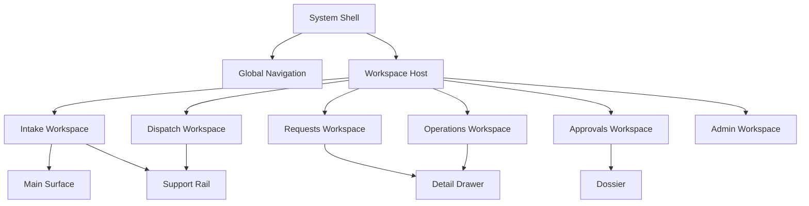

# Frontend Interface Reconstruction Plan — BG Application

## Document Role

- Status: `execution plan`
- Scope: live frontend reconstruction priorities and completion boundary
- Documentation index: [README.md](README.md)
- Architecture baseline: [ARCHITECTURE.md](instructions/ARCHITECTURE.md)
- Visual reference library: [ui-proposals/README.md](ui-proposals/README.md)

## Boundary

This file owns the live frontend execution boundary.

- Use it to decide what frontend work is still active, complete, deferred, or explicitly out of scope.
- Use [ARCHITECTURE.md](instructions/ARCHITECTURE.md) for the higher-level architectural baseline.
- Use [ui-proposals/README.md](ui-proposals/README.md) as the binding visual reference library.
- Use `audits` as supporting diagnostic context, not as the first execution source when this file already defines the current boundary.

This document outlines the strategic reconstruction of the BG application's frontend. It transitions the system from a high-consistency but low-abstraction Razor-based UI to a modern, component-driven, and interactive system.

## Institutional Direction Baseline

BG is an internal hospital system, not a public marketing product. Because of
that, the official KFSHRC website is now an approved institutional direction
source for the frontend:

- Official reference: <https://www.kfshrc.edu.sa/>

This reference must guide:

- institutional visual tone
- green-led brand discipline
- bilingual presence
- calm and structured shell behavior
- navigation composure and trust cues

This reference should **not** be copied literally into BG as:

- a public discovery experience
- a brochure-style content hierarchy
- a marketing or editorial layout pattern

Operational translation rule:

BG should inherit the institutional shell language of KFSHRC, then compose it
into role-based operational workspaces, queues, drawers, and dossiers.

## Proposal Library Mandate

The `docs/ui-proposals` folder is not optional inspiration anymore.

It is now a binding reconstruction library.

This means:

- shell, workbench, queue, drawer, and dossier composition must be derived from
  that library
- deviations are allowed only when they are caused by role, permission, or
  workflow-state differences
- deviations are not allowed merely because a local implementation feels easier
  or faster
- any structural difference must be explained before implementation, not after

## 2026-03-13 Reconstruction Status

The current reconstruction pass has now materially completed these phases in
the live codebase:

- `Phase 1`: institutional shell and surface-zone contract
- `Phase 2`: surface realignment across the core operational workspaces
- `Phase 3`: first stable shared primitive extraction
- `Phase 4`: first CSS modularization layer

Completed surfaces now follow the reconstructed composition model:

- `Intake`
- `Approvals`
- `Requests`
- `Operations`
- `Dispatch`
- `Administration`

Completed shared frontend infrastructure now includes:

- shell zones: `Main`, `Support Rail`, `Detail Drawer`, `Dossier`
- shared surface primitives
- shared queue/list primitives
- shared actor-context primitive
- extracted shell and surface CSS layers

This means the current frontend effort should no longer be treated as an
open-ended surface reconstruction pass.

The next frontend boundary is now:

- guided operator validation on the reconstructed surfaces
- targeted role/state refinements where live usage proves the need
- selective interaction enhancements only where the runtime gain is verified

It is **not**:

- another broad page reshuffle
- another shell rewrite
- premature migration to a richer client runtime

## Stage 1 — Reconstruction Goals

### Frontend Reconstruction Objectives
1. **Eliminate Structural Duplication**: Replace copy-pasted HTML structures with a robust component system (Razor Tag Helpers/View Components).
2. **Modularize the Styling Layer**: Break down the monolithic `site.css` into domain-specific modules or utility-first patterns to improve maintainability and build times.
3. **Enhance Interaction Fluidity**: Introduce selective partial interactivity only where the operational gain is proven, while keeping server-driven Razor behavior as the baseline.
4. **Standardize Visual Language**: Enforce design tokens at the component level to ensure perfect fidelity across new and legacy surfaces.
5. **Improve Developer Velocity**: Reduce the "lines of code" required to build a new screen by 60% through high-level abstractions.

### Rebuild Scope Definition
- **In-Scope**: Layout shells, Workspace pages, UI Components, Styling architecture, Interaction patterns, Client-side scripting strategy.
- **Out-of-Scope**: Domain logic, Database schema, API contracts (unless UI-driven), Authentication mechanisms.

### Institutional UX Constraint

Every frontend decision must satisfy both of these conditions together:

1. It must feel aligned with KFSHRC as an institutional environment.
2. It must still behave like an internal employee workbench.

If a proposal improves polish but pushes the system toward a marketing, blog,
or brochure feeling, it should be rejected.

Additional mandatory rule:

If a proposal or implementation drifts away from the proposal library's shell,
surface split, drawer, or dossier composition, it should also be rejected even
if it remains visually polished.

### Preserve vs Rebuild Matrix

| Component | Strategy | Rationale |
| :--- | :--- | :--- |
| **Business Logic** | **Preserve** | The Domain and Application layers are solid and tested. |
| **Page Layouts** | **Rebuild** | Current layouts are hardcoded in Razor; need a flexible Shell pattern. |
| **Styling (CSS)** | **Refactor** | Design tokens are excellent; the delivery mechanism (monolith) is flawed. |
| **Tables/Grids** | **Standardize** | Variations in grid implementation lead to divergent behavior. |
| **Form Logic** | **Standardize** | Validation and layout are currently tightly coupled to specific pages. |
| **Interactions** | **Augment** | PRG (Post-Redirect-Get) should remain the fallback, but partial updates are needed. |

---

## Stage 2 — Future Frontend Architecture Model

### Target Frontend Architecture Model
The target architecture moves toward a **Role-Composed Workspace Shell** model.

- **System Shell**: The persistent institutional frame (Sidebar Navigation + Top Bar + Background).
- **Workspace Host (Razor Page)**: A standard Razor Page serves as the entry point and master context for a business area.
- **Surface Zones**: Each workspace is composed from stable zones such as `Main Surface`, `Support Rail`, `Detail Drawer`, and `Dossier`.
- **Role-State Composition**: The same component vocabulary is composed differently depending on role, permission, ownership, and workflow state.

### Workspace Routing Model
| Layer | Technology | Role |
| :--- | :--- | :--- |
| **Workspace** | Razor Page | High-level URL routing, Auth, and Initial Data hydration. |
| **Section** | Partial View / Razor fragment | Stable server-rendered surface sections. |
| **Drawer / Tabs** | Server-rendered by default, client-enhanced selectively | Volatile and secondary UI state when needed. |

### Interface Relationship Map

### Screen-Type Taxonomy
1. **Command Centers (Workspaces)**: High-density, multi-step surfaces (e.g., Intake).
2. **Operational Lanes (Queues)**: Optimized for scanning and rapid triage.
3. **Configurators (Admin)**: Form-heavy, entity-management surfaces.
4. **Dossiers (Detail Views)**: Read-heavy, hierarchical information displays.

### Institutional Translation Rule

The official KFSHRC site should guide:

- shell hierarchy
- institutional branding tone
- bilingual discipline
- visual trust and restraint

The BG proposal library should define:

- workbench density
- queue behavior
- decision placement
- document-first layouts
- dossier composition
- shell zoning and split behavior
- left-navigation and active-item relationship
- what stays primary vs secondary vs on-demand

Therefore the correct frontend target is:

`KFSHRC institutional shell language + BG operational composition model`

### Execution Companions

This plan must now be read together with:

- [2026-03-13-component-role-visibility-matrix.md](audits/2026-03-13-component-role-visibility-matrix.md)
- [README.md](ui-proposals/README.md)

And those two documents are not advisory-only; they are binding execution
companions.

---

## Stage 3 — Component System Reconstruction

### Component System Blueprint
To avoid **Over-abstraction** and "Component Explosion," we will categorize the system into three distinct tiers.

#### 1. Primitives (Atomic)
*Pure UI elements without domain context.*
- `<bg-button>`: Primary, Secondary, Danger, Icon variants.
- `<bg-badge>`: Status indicators (Draft, Active, Pending, Error).
- `<bg-input>` / `<bg-select>`: Themed form elements with local validation.
- `<bg-pill>`: Metadata tags.

#### 2. Layout (Structural)
*Reusable structural containers.*
- `<bg-section>`: The standard workspace section wrapper.
- `<bg-card>`: Standardized content container (replaces generic `.info-card`).
- `<bg-panel>`: Slide-over or side-panel containers.
- `<bg-grid>`: Flexible layout manager for content alignment.

#### 3. Domain Components (Contextual)
*Components tied to the BG business domain.*
- `<bg-request-card>`: Specialized request summary.
- `<bg-approval-panel>`: Governance-specific decision surface.
- `<bg-timeline>`: Audit trail for guarantee workflows.
- `<bg-dossier-header>`: Summary bar for guarantee identity.

### Component API Standards
To prevent components from becoming opaque "HTML fragments," all Tag Helpers must follow these property naming conventions:

1. **Variants**: Use `variant` for visual styles (`primary`, `secondary`, `danger`).
2. **Sizing**: Use `size` for structural scaling (`sm`, `md`, `lg`).
3. **State Management**: Use `is-loading`, `is-disabled`, `is-active` booleans.
4. **Data Binding**: Use `for` (ModelExpression) to automatically bind to domain models and validation.
5. **Slots**: Use clear nested tags for content areas (e.g., `<bg-card-header>`, `<bg-card-actions>`).

### Component Source Rule

The `docs/ui-proposals` folder should now be treated as a **component source
library**, not a set of fixed page mockups.

This means:

- each proposal may expose one or more reusable components
- not every role sees every component
- components are composed according to role and workflow state
- no component should be extracted into infrastructure until its owning surface
  is stable enough
- the proposal library is mandatory at the composition level, not optional at
  the taste level
- local implementation convenience is not a valid reason to ignore the proposal
  structure

### Component Hierarchy & Standardization Plan
1. **Phase A**: Stabilize role-specific surface contracts before extracting shared primitives.
2. **Phase B**: Audit repeated patterns such as `.info-card`, property pairs, action rows, and drawer panels only after they stop shifting structurally.
3. **Phase C**: Extract the proven primitives into Tag Helpers/View Components.
4. **Phase D**: Implement standardized micro-behaviors only where the operating value is clear.

---

## Stage 4 — Layout and Workspace Reconstruction

### Workspace Reconstruction Plan

#### 1. Intake Workspace (Target: Document-First Split Workbench)
- **Problem**: Long scrolling forms with documents at the top.
- **Solution**: Sticky split-view (50/50). The document remains in view on the left while the user verifies fields on the right.
- **Density**: High density in data panels, using `<bg-property-grid>` to maximize space.

#### 2. Approvals Workspace (Target: Decision-First With Separate Dossier Depth)
- **Problem**: Context, governance, and action were previously competing at the same level.
- **Solution**: Keep the decision surface primary, and move full-depth read-heavy context into a dossier or secondary panels.
- **Interaction**: Approval action remains server-driven first, with optional selective enhancement later.

#### 3. Requests Workspace (Target: Owner Queue + Active Request Panel)
- **Problem**: The owner surface can easily drift into a dossier rather than a workbench.
- **Solution**: The owner sees their queue, active request state, next step, and limited supporting context first.

#### 4. Operations Workspace (Target: Triage Queue + Matching Decision Panel)
- **Problem**: Review lanes can accumulate evidence, matching, and audit depth in a single card.
- **Solution**: Keep the queue and decision panel primary, while bank evidence and audit depth stay secondary or on demand.

#### 5. Dispatch Workspace (Target: Handoff Queue + Execution Panel)
- **Problem**: Print, dispatch, delivery, and evidence can collapse into one long stacked surface.
- **Solution**: Keep ready actions and pending delivery actions primary; move evidence into secondary detail.

#### 6. Administrative Screens (Target: Grid-to-Form)
- **Problem**: Divergent grid styles for Users, Roles, and Workflow.
- **Solution**: The `<bg-admin-grid>` component with integrated search/filter and slide-over side panels for entity editing (avoiding full page navigations).

### Layout Strategy Matrix

| Area | Information Hierarchy | Disclosure Strategy | Default Visibility |
| :--- | :--- | :--- | :--- |
| **Intake** | Document -> Core Data -> Notes | Tabbed sidebar for secondary data | PDF + Verification Form |
| **Approvals** | Current decision -> Governance blocker -> Approval evidence | Dossier for full history | Current Stage + Signers |
| **Requests** | Identity -> Proposed Change -> Next Step | Drawer or collapsed sections for deep history | Active Owner Actions |
| **Operations** | Selected item -> Matching confidence -> Apply action | Drawer for document and audit depth | Review Decision |
| **Dispatch** | Ready action -> Pending delivery -> Handoff evidence | Secondary evidence panels | Dispatch Actions |
| **Admin** | Core Attributes -> Relations -> Logs | Nested tabs inside side-panel | Main List/Grid |

---

## Stage 5 — Interaction Architecture Reconstruction

### Interaction Reconstruction Blueprint
The system should remain **Server-Driven by Default**, with selective
augmentation only where full refreshes create real operational friction.

#### 1. Form Interactions (The "Live" Feel)
- **Problem**: Users must click "Save" to see validation errors.
- **Future Model**: Inline validation is desirable, but only where it improves operator speed without obscuring the server truth model.
- **Priority**: High (Reduces operator frustration).

#### 2. Navigation & Workflow (The "Single Surface")
- **Problem**: Navigating between Workspace steps (e.g., Step 1 to Step 2) causes full page reload, losing scroll position and focus.
- **Future Model**: Preserve workspace continuity first through better surface composition; use partial swapping only when the gain is proven.
- **Priority**: Medium.

#### 3. Search & Filter (The "Instant Result")
- **Problem**: Lists require a "Filter" button click and reload.
- **Future Model**: Search and filtering may be selectively enhanced to reduce queue friction, but must keep a full server-rendered fallback.
- **Priority**: High (Critical for Operations Queue).

### Interaction Standardization Rules
1. **Modals**: Used ONLY for destructive actions (Delete, Reject) or complex secondary configuration.
2. **Slide-overs**: Used for entity editing within a workspace to maintain context.
3. **Optimistic UI**: Avoid optimistic state changes in governance-sensitive actions unless the server remains the explicit source of truth.

---

## Stage 6 — Styling System Reconstruction

### Styling Reconstruction Plan
We will maintain the current **Design Token** system but refine the relationship with Bootstrap.

- **Tokens**: Preserve `site.css` variables for Colors, Spacing, and Type.
- **Bootstrap Strategy**: Transitional **Layout-Only** approach.
  - Bootstrap will be restricted to Grid/Layout utilities only.
  - Custom component styles will replace Bootstrap component classes (e.g., buttons, cards).
  - **Gradual Removal**: Bootstrap utility classes will be phased out in favor of the standardized Component System to prevent style collisions.
- **Status Color Architecture**: Standardize `bg-status-*` classes globally.

### Institutional Styling Direction

The official KFSHRC website should be treated as the institutional direction
source
for:

- header composure
- green-led palette discipline
- calm white/neutral surface balance
- restrained, trustworthy presentation
- bilingual shell treatment

BG should then translate that into an internal system style with:

- denser work surfaces
- stronger task-first hierarchy
- clearer role-based navigation
- stronger action emphasis than the public website

### Design Token Plan
| Token Category | Strategy | Implementation |
| :--- | :--- | :--- |
| **Colors** | Strict Palette | CSS Variable Mapping (e.g., `--bg-primary`) |
| **Spacing** | 4px Baseline | `gap-1` = 4px, `gap-2` = 8px scaling |
| **Typography** | Semantic Scaling | `text-heading-lg`, `text-body-sm` |
| **Shadows** | Depth Scale | `--shadow-sm` (flat), `--shadow-lg` (elevated) |

---

## Stage 7 — Dependency Strategy

### Dependency Adoption Plan

| Category | Decision | Rationale |
| :--- | :--- | :--- |
| **Grid/Layout** | **Bootstrap 5** | Restricted to Layout only. Phased removal of utilities. |
| **Interactions** | **Selective HTMX later** | Use only where a proven operational need exists after surface contracts stabilize. |
| **UI Logic** | **Selective Alpine.js later** | Use only for small local UI islands when server-rendered structure remains primary. |
| **Legacy JS** | **Legacy jQuery** | **Zero New jQuery Rule**: No new features or refactors can use jQuery. Existing code only until migration. |

### Institutional Technology Constraint

Technology choices must support two non-negotiable frontend constraints:

1. BG remains visually and behaviorally aligned with the KFSHRC internal
   systems environment.
2. BG remains simple enough to be maintained on the current server-driven stack
   without unnecessary UI framework churn.

This means:

- no competing design framework should replace the institutional
  Bootstrap-based baseline without a proven operational reason
- no interaction library should be introduced merely for novelty or visual
  fashion

### Core Table Capability Matrix
Custom tables must implement these four mandatory capabilities to prevent "Table Variation" drift:

1. **Sorting**: Native column-header sorting with a server-rendered fallback, optionally enhanced later where queue performance and usability justify it.
2. **Paging**: Standardized `<bg-pager>` footer integrated with the `RepositoryPaging` logic.
3. **Action Registry**: A standard "Slot" for row-level actions (Edit, Approve, Delete) with uniform spacing and hover triggers.
4. **Resiliency**: Default "Empty State" component for zero-result queries.

### Keep / Build / Buy Matrix
- **Keep**: Bootstrap, jQuery (legacy only).
- **Build**: All BG-prefixed components (Tag Helpers).
- **Adopt (New)**: HTMX and Alpine.js only where the runtime gain is now undeniable.

---

## Stage 8 — Migration Strategy

### Frontend Migration Roadmap
We will follow a **"Vertical Slice"** migration to minimize disruption. Existing Razor pages will be converted one workspace at a time.

#### Phase 1: Institutional Shell and Surface Contracts
- Lock the KFSHRC-aligned shell direction.
- Define role/state visibility rules and component ownership.
- Stabilize workbench zones: `Main`, `Support Rail`, `Detail Drawer`, `Dossier`.
- **Constraint**: Do not extract shared infrastructure from unstable patterns.

#### Phase 2: Surface Realignment
- Reconstruct the operational surfaces role-by-role:
  - `Intake`
  - `Approvals`
  - `Requests`
  - `Operations`
  - `Dispatch`
- Keep the behavior server-driven and task-first.

#### Phase 3: Component Extraction
- Extract only the patterns that survived real surface use:
  - cards
  - panels
  - property pairs
  - queue rows
  - drawers
  - dossier sections

#### Phase 4: Styling Modularization
- Split the monolithic styling into surface or component modules.
- Retire legacy duplicate classes only after the replacement patterns are proven.

#### Phase 5: Selective Interaction Enhancements
- Introduce partial interactivity only where the operating benefit is proven:
  - queue filtering
  - lightweight drawer refreshes
  - local tab or toggle state

Current status:
- `Phases 1-4` are materially complete in implementation.
- `Phase 5` is intentionally deferred until structured operator review confirms
  the highest-friction interactions.

---

## Stage 9 — Prioritization and Execution Order

### Priority Matrix

| Priority | Item | Rationale |
| :--- | :--- | :--- |
| **Critical** | Institutional shell + role/state visibility contract | Prevents future UI drift and keeps the system aligned with KFSHRC internal use. |
| **High** | Intake document-first workbench | Defines the strongest document-centric pattern in the product. |
| **High** | Approvals decision surface + dossier separation | Highest governance and cognitive-load risk. |
| **High** | Requests owner queue | Prevents owner surfaces from turning into dossier-heavy pages. |
| **High** | Operations and Dispatch queue workbenches | Core triage and handoff surfaces for daily execution. |
| **Medium** | Component extraction and CSS modularization | Should follow stabilized surfaces, not precede them. |
| **Later** | Selective HTMX/Alpine enhancement | Useful only after the structural model is stable. |

### Execution Sequence
1.  **Step 1**: Lock institutional shell direction and role/state composition rules.
2.  **Step 2**: Stabilize the five operational surfaces.
3.  **Step 3**: Extract shared primitives from the patterns that held.
4.  **Step 4**: Modularize CSS and retire duplicate legacy surface code.
5.  **Step 5**: Add selective interaction enhancement where the gain is proven.

Execution status:
- `Steps 1-4` are now materially complete.
- `Step 5` is the next frontend phase boundary, but only after operator-facing
  review on the reconstructed baseline.

---

## Stage 10 — Risk Control

### Frontend Rebuild Risk Register

| Risk | Impact | Mitigation Strategy |
| :--- | :--- | :--- |
| **UI Inconsistency** | High | Use the same Design Tokens for both legacy and new styles to mask the transition. |
| **Breaking Governance** | Critical | 1:1 Integration tests for Approval Actions during reconstruction. |
| **Partial Refactor Failure** | Medium | Ensure new components can coexist with legacy Bootstrap utility classes. |
| **Premature Componentization** | High | Do not extract shared components before surface ownership and role visibility are stable. |
| **Public-Site Mimicry** | High | Use KFSHRC as institutional direction only, not as a public-layout template for workbenches. |
| **Selective Interaction Overreach** | Medium | Keep PRG and server-rendered fallbacks for every enhanced interaction. |

### Mitigation Plan
- **Surface Ownership First**: Approve each surface contract before extracting shared infrastructure from it.
- **Vertical Validation**: Keep hosted coverage over the real workspaces instead of introducing parallel `/New*` routes by default.
- **Rollback Through Git, Not Shadow Files**: Use version control and small vertical slices instead of `.cshtml.bak` files.

---

## Stage 13 — Technical Engagement Rules

To ensure interaction consistency and prevent "fragmentation," all client-side logic must follow these technical boundaries:

| Interaction Type | Primary Tech | Reason |
| :--- | :--- | :--- |
| **Server Interaction** | **Razor Pages + PRG by default** | Keeps business actions explicit, traceable, and aligned with the current stack. |
| **Local UI State** | **HTML/CSS first, Alpine.js selectively** | Use Alpine only for small volatile state where server rendering adds no value. |
| **Form Submission** | **Server post first** | Critical workflow actions should remain server-first unless a partial enhancement is clearly beneficial. |
| **Partial Refreshes** | **HTMX selectively** | Use only for proven queue, drawer, or validation friction. |
| **Micro-Animations** | **CSS first** | Visual polish should not require a new client runtime by default. |

---

## Stage 12 — UI Pattern Catalogue

Before component construction, all development must adhere to these five core **Screen Patterns**.

### 1. The Workspace (Operational Canvas)
- **Use Case**: Complex, multi-step tasks (Intake, Request Revision).
- **Structure**: Permanent Document/Summary sidebar + Sequential Tabbed form body.
- **Interaction**: Server-first step flow, with optional enhancement only if the operator benefit is clear.

### 2. The Queue (Triage Lane)
- **Use Case**: Operations and Approval lists.
- **Structure**: Multi-column list with density controls and immediate "Search-as-you-type" filtering.
- **Interaction**: Click-to-open Side Panel (Slide-over) for rapid review.

### 3. The Dossier (Information Master)
- **Use Case**: Viewed when a record is "Opened" from a queue.
- **Structure**: Header (Entity Identity) + Left Nav (Categorized data views) + Main Content (Read-heavy).

### 4. The Admin Grid (Management Console)
- **Use Case**: User/Role management.
- **Structure**: Standardized table with "Actions" column and side-panel for entity creation/editing.

### 5. The Form Editor (Configuration surface)
- **Use Case**: Metadata editing or settings.
- **Structure**: Single or Dual-column form with server-rendered validation first, optionally enhanced later.

---

## Stage 11 — Executive Reconstruction Summary

The BG Frontend Reconstruction Plan is a targeted architectural upgrade designed to solve the rigidity, duplication, and operator-cognitive-load issues identified in the audit.

**The strategy is not a "Big Bang" rewrite.** It is a controlled transition toward an institutional, role-based workbench model that respects the existing business logic while replacing the fragile UI composition model.

The plan now assumes:

- KFSHRC institutional shell language is the official directional baseline
- BG workspaces are composed by role and workflow state
- surfaces are stabilized before broad component extraction
- client-side enhancement is selective, not the starting point

### Final Recommended Rebuild Strategy
1.  **Stabilize**: Lock the institutional shell and role/state visibility rules.
2.  **Compose**: Rebuild each workspace as a real workbench with clear ownership of execution, support, and dossier depth.
3.  **Componentize**: Extract only the UI patterns that have proven stable.
4.  **Modularize**: Break the monolithic CSS into scoped, component-bound or surface-bound styles.
5.  **Enhance Selectively**: Introduce partial interactivity only when the operational benefit is verified.

---

# Rebuild Decision

### What should be rebuilt first?
The **institutional shell contract** and the **role/state composition rules**. After that, the operational workspaces should be stabilized as workbenches before broad component extraction continues.

### What should not be touched yet?
The **Domain Core and DB Schema**. The frontend reconstruction should remain purely a "Presentation and Interaction" layer change. Touching the data model concurrently will exponentially increase migration risk.

### What can remain as-is?
The **Server-Side Validation Logic** and **Legacy Admin Controllers**. The logic is sound; only the way it is *presented* (the View) needs to change.

### What must be standardized before any future UI expansion?
The **Section-Shell, Information Hierarchy, and Role Visibility Rules**. No new feature should be allowed to introduce a surface where execution depth, dossier depth, and audit depth all compete at the same level.

### What technical frontend mistakes would become dangerous if ignored now?
The most dangerous mistakes now are:

1. **Monolithic CSS Growth**: continuing to grow `site.css` without modularization.
2. **Premature Componentization**: extracting shared primitives before the surfaces themselves stabilize.
3. **Institutional Drift**: building visually polished screens that no longer feel like part of the KFSHRC internal systems environment.

---
*Plan Authored by Chief Frontend Architect Antigravity*
