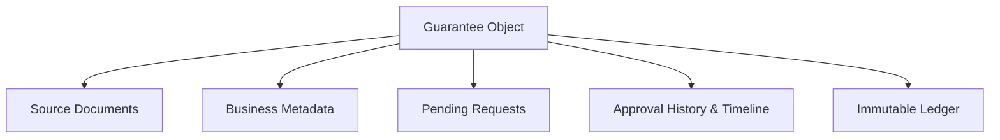

# Operational UX Architecture Manifesto: BG System

**Status**: Refined Architectural Standard  
**Author**: Chief Product Designer & UX Systems Architect  
**Purpose**: Defining the core structural logic and decision architecture for the Bank Guarantee (BG) Management System.

---

## 1. System Intent & Operational Goal

The BG system is NOT a document archive or a data entry portal. It is an **Operational Governance Platform** for Bank Guarantees.

- **Primary Object**: The **Guarantee Lifecycle** (not the PDF).
- **Goal**: Maintain the integrity, auditability, and movement of a guarantee from intake to closure.

---

## 2. The Operational Unit

The fundamental object of the system is the **Guarantee**. Every other entity is a metadata attribute or a lifecycle event.

| Component | Operational Classification |
| :--- | :--- |
| **Document** | Evidence (Provenance) |
| **Request** | Action Trigger |
| **Approval** | Governance Decision |
| **Dispatch** | External Event |
| **Ledger** | Chronological History |

---

## 3. System Mental Model

The UI must project a hierarchical relationship centered on the core object:

---

## 4. Operational Stages (System States)

These are NOT menu items; they are states in the lifecycle of a guarantee:

1. **Intake**: Digitization of physical reality.
2. **Verification**: Accuracy check of extracted data.
3. **Activation**: Commitment to the system of record.
4. **Lifecycle Requests**: Active modification (Extension, Reduction, etc.).
5. **Approval**: Governance validation.
6. **Execution/Dispatch**: Finalization and communication.
7. **Closure**: Archive.

---

## 5. User Persona Metrics

| Role | Responsibility | Core Metric |
| :--- | :--- | :--- |
| **Intake Operator** | Document → Record | **Speed + Accuracy** |
| **Request Owner** | Record → Action | **Workflow Clarity** |
| **Approver** | Governance Decision | **Risk Mitigation** |
| **Dispatcher** | Protocol Delivery | **Delivery Assurance** |

---

## 6. The Three Decisions Architecture

The system exists to support three (and only three) primary decision types:

1. **Verification Decision**: Is the extracted data a 1:1 reflection of the document? (Intake)
2. **Operational Decision**: What business action is required next? (Request Owner)
3. **Governance Decision**: Does this action comply with policy and risk thresholds? (Approver)

---

## 7. The Golden Rule of BG UX

**Focus on the "Next Decision", not "All Information".**

The UI must proactively filter data to present only what is necessary for the current decision gate. Any information that does not serve the immediate decision is considered "Cognitive Noise".

---

## 8. Management by Exception

The system should handle the routine and highlight the exceptional.

- **Routine (Low Risk)**: High OCR confidence (>95%) or minor value changes → **Collapsed/Aggregated UI.**
- **Exception (High Risk)**: Low confidence, governance blockers, or major value shifts → **High-Contrast/Expanded UI.**

---

## 9. Structural UI Commandments

1. **Workspaces are for Tasks**: A workspace should answer: *"What requires my attention right now?"*
2. **Lists are for Master Views**: Use lists for scanning and prioritization only. Never embed deep history in a list card.
3. **Dossiers are for Deep Data**: All metadata, ledgers, and history live in the detail pane/page (Dossier).
4. **Master-Detail over Infinite Scroll**: Use structural panes to prevent "Vertical Bloat".

---

## 10. Audit-Driven Risk Assessment

Based on current diagnostics, the following "Architecture Cracks" must be remediated:

- **Risk 1: Density Explosion**: Moving away from card-expansion to avoid "The Scroll Wall".
- **Risk 2: Gaze Fatigue**: Aligning document review into a dual-pane focused view.
- **Risk 3: Metadata Dominance**: Suppressing engineering/OCR metadata in favor of business-critical fields.

---

## 11. Final Architect's Directive

The UI should never reflect the *database structure*. It must reflect the *user's decision sequence*. 

If the UI looks like a "Spreadsheet with buttons", it has failed. It must look like a **Decision Cockpit**.

---

### End of Manifesto
