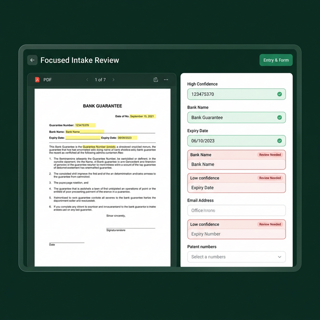
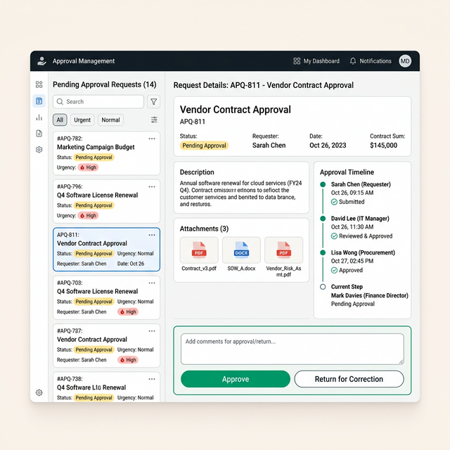

# UX Audit Walkthrough

I have completed a comprehensive UX audit of the BG system, following the stages of analysis requested, including a new **Technical UI Architecture Audit**.

## Key Artifacts Produced

- [ux_audit_report.md](ux_audit_report.md)
- [operational_ux_architecture.md](operational_ux_architecture.md)
- [operational_manifesto.md](operational_manifesto.md)
- [ui_architecture_report.md](ui_architecture_report.md)
- [ux_remediation_plan.md](ux_remediation_plan.md)
- [detailed_design_solutions.md](detailed_design_solutions.md)

## Highlights of the Analysis

### System Understanding

The system is built on a **Centralized Workspace Model**, where high functional isolation is achieved but at the cost of extreme information density. User roles are clearly defined (Intake, Request Owner, Approver, Dispatcher), each with a dedicated operational environment.

### Visual Audit Evidence

I performed a live visual audit to validate my code-based findings. The following media demonstrates the identified friction points and proposed solutions:

````carousel

<!-- slide -->

````

### Technical UI Findings

The technical audit revealed a **"Component-less MPA"** architecture. While visual consistency is high, the lack of centralized UI components creates a significant maintenance risk. I have recommended adopting **HTMX** and **Alpine.js** to introduce interactivity without the overhead of a full SPA framework.

## Next Steps

This audit serves as a diagnostic foundation. We have now provided:
1. A deep diagnostic of the operational architecture.
2. A technical evaluation of the UI layer.
3. A phased remediation plan.
4. Detailed design solutions with high-fidelity mockups.

We are ready to proceed with implementation or further design iterations as requested.
