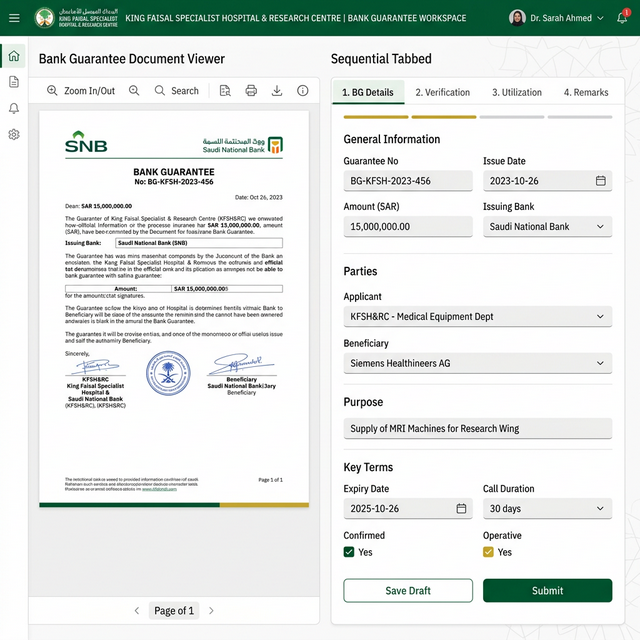
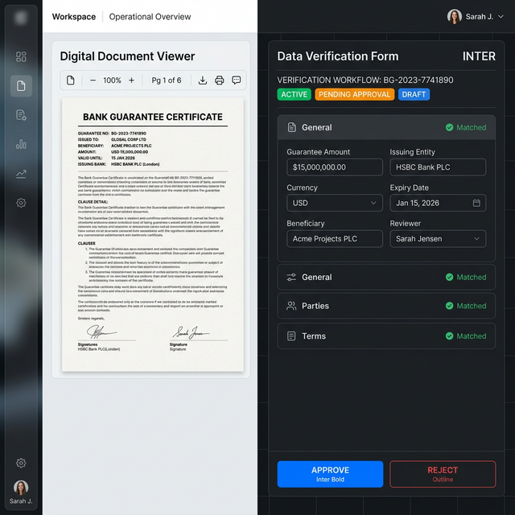
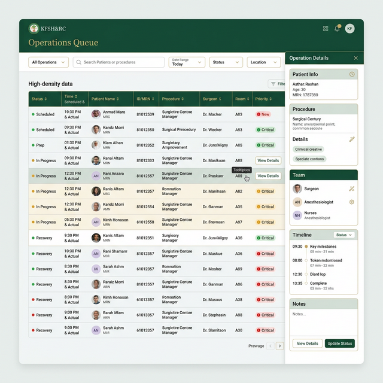
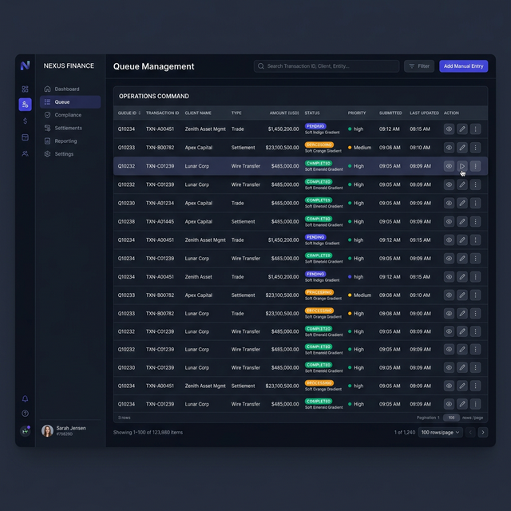
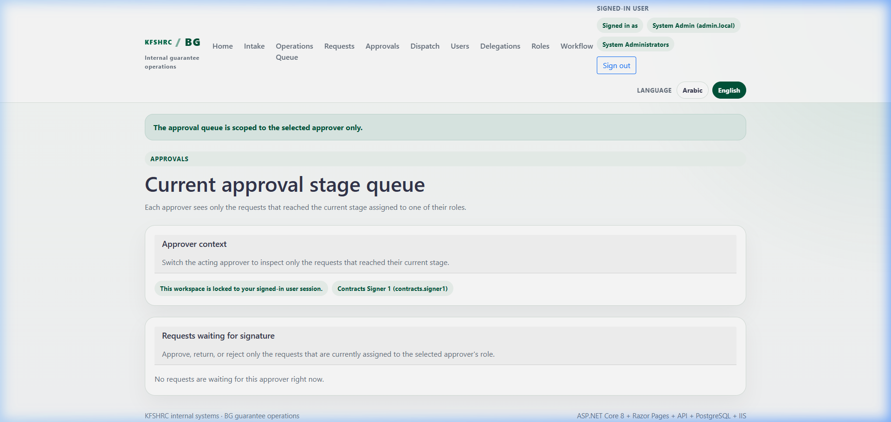
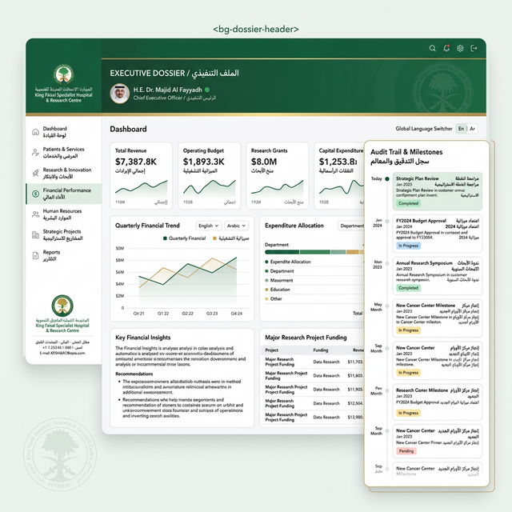
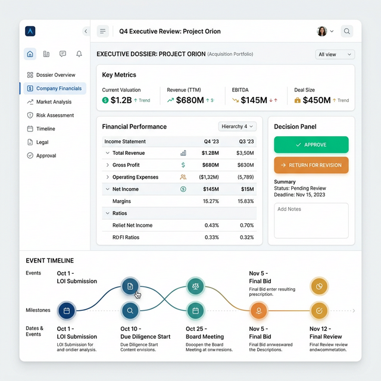

# مقترحات واجهات المستخدم (UI Proposals)

هذا المجلد يحتوي جميع الصور المرجعية الخاصة بالاتجاه الجديد لواجهات BG، وليس فقط ثلاثة نماذج مختصرة. جميع الصور الموجودة هنا مطلوبة كمرجع بصري وتشغيلي أثناء إعادة بناء الواجهة.

## الهدف من هذا المجلد
- تثبيت الاتجاه العام للواجهات كمساحات عمل تشغيلية فعلية وليست صفحات سردية.
- توضيح أنماط `split-view`, `queue + detail drawer`, و`dossier` المستقلة.
- جمع النماذج الأساسية والبدائل التطورية واللقطات المرجعية الحالية في مكان واحد.

## كيف يُستخدم هذا المجلد
- الصور هنا للإيحاء والاتجاه، لا للنسخ الحرفي.
- بعض الملفات نسخ متطابقة من نفس الصورة، وتم الإبقاء عليها لأنها جزء من التسلسل المرجعي الحالي.
- بعض الصور تمثل مرحلة أولية، وبعضها يمثل refinement لاحق لنفس الفكرة.

## فهرس كامل للصور

### 1. نماذج بيئة العمل المنقسمة (Workspace Split View)

#### `workspace_split_view.png`
مرجع أساسي لواجهة عمل منقسمة: عارض مستند على اليسار ونموذج تحقق متسلسل على اليمين.

#### `workspace_split_view1.png`
نسخة مطابقة لـ `workspace_split_view.png` محفوظة ضمن نفس الحزمة المرجعية.

#### `workspace_split_view2.png`
نسخة بديلة أكثر قتامة وتركيزًا على تباين المستند مع نموذج التحقق.

#### `ChatGPT Image Mar 13, 2026, 03_00_09 AM.png`
مصفوفة مرجعية تجمع ثلاث أسطح متجاورة: `Intake`, `Requests`, `Approvals` في صيغة workbench موحدة.

#### `ChatGPT Image Mar 13, 2026, 03_09_31 AM.png`
refinement لاحق لفكرة الواجهات الثلاث المتجاورة مع drawer مركزي وسياق تنقل أوضح.

### 2. نماذج قوائم الانتظار ومساحات القرار (Queues and Decision Surfaces)

#### `operations_queue.png`
مرجع أساسي لقائمة عمليات عالية الكثافة مع لوحة تفاصيل جانبية مستقلة.

#### `operations_queue1.png`
نسخة مطابقة لـ `operations_queue.png` محفوظة ضمن نفس الحزمة المرجعية.

#### `operations_queue2.png`
نسخة بديلة أكثر كثافة وداكنة تركز على الجدول التشغيلي والقرارات السريعة داخل الصف نفسه.

#### `ChatGPT Image Mar 13, 2026, 02_56_23 AM.png`
مرجع لقائمة طلبات بصيغة `queue + right detail drawer` مع البحث والفلاتر في الأعلى.

#### `ChatGPT Image Mar 13, 2026, 03_23_31 AM.png`
نسخة refined لمساحة الطلبات تركّز على القائمة الوسطى، بطاقة العنصر النشط، وdetail drawer مستقل.

#### `ChatGPT Image Mar 13, 2026, 02_56_29 AM.png`
مرجع مبكر لمساحة الموافقات بصيغة قرار مباشر مع عمود جانبي للتواقيع السابقة والملفات المرفقة.

#### `ChatGPT Image Mar 13, 2026, 03_21_04 AM.png`
مرجع أكثر كثافة لمساحة قرار الموافقة مع تبويبات `Summary / Documents / Timeline / Notes` وأزرار قرار بارزة.

#### `approvals_queue_success_17733582050902.png`
لقطة مرجعية من الحالة الحالية داخل المشروع بعد إصلاح عطل قائمة الموافقات. هذه الصورة مهمة للمقارنة بين الوضع الحالي والاتجاه المستهدف.

### 3. نماذج الإدخال والتحقق المرتكزة على المستند (Document-Centric Intake and Review)

#### `ChatGPT Image Mar 13, 2026, 03_09_14 AM.png`
مرجع واضح لمساحة `Intake` بثلاث مناطق عمل: عارض المستند، نموذج التحقق، ومعاينة/نشاط جانبي.

#### `ChatGPT Image Mar 13, 2026, 03_16_23 AM.png`
مرجع لسطح مراجعة/استفادة من الضمان بصيغة تبويبات عليا ومستند مركزي وملخص ضمان جانبي.

### 4. نماذج الملف التنفيذي وملفات القرار (Executive Dossier and Dossier Variants)

#### `executive_dossier.png`
مرجع أساسي لواجهة dossier تنفيذية متعددة الأقسام مع شريط تنقل جانبي وزمنية قرارات.

#### `executive_dossier1.png`
نسخة مطابقة لـ `executive_dossier.png` محفوظة ضمن نفس الحزمة المرجعية.

#### `executive_dossier2.png`
نسخة بديلة أكثر تركيزًا على `decision panel` وtimeline الأفقي داخل dossier تنفيذية أخف.

## ملخص الاتجاه البصري والتشغيلي المستفاد من جميع الصور
- الواجهة المستهدفة هي `workbench` عملية وليست صفحة سردية طويلة.
- العناصر الأساسية يجب أن تُقسم إلى:
  - قائمة أو مستند أساسي في المنتصف
  - سطح قرار مباشر قريب من العنصر
  - drawer أو sidebar للتفاصيل الثانوية
- `dossier`, `audit`, `timeline`, و`attachments` يجب أن تبقى طبقة منفصلة أو ثانوية، لا أن تتكدس مع الفعل الرئيسي.
- التنقل العام ينبغي أن يكون side navigation ثابتًا وواضحًا حسب الدور.
- الأولوية البصرية يجب أن تكون للمهمة الحالية والقرار التالي، لا لكل metadata التي يعرفها النظام.

## ملاحظات تنظيمية
- الملفات المتطابقة حاليًا:
  - `workspace_split_view.png` = `workspace_split_view1.png`
  - `operations_queue.png` = `operations_queue1.png`
  - `executive_dossier.png` = `executive_dossier1.png`
- تم الإبقاء عليها كما هي حاليًا لأن المطلوب أن يبقى هذا المجلد مرجعًا كاملًا لكل الصور المستخدمة في النقاش، لا فقط النسخ الفريدة.
