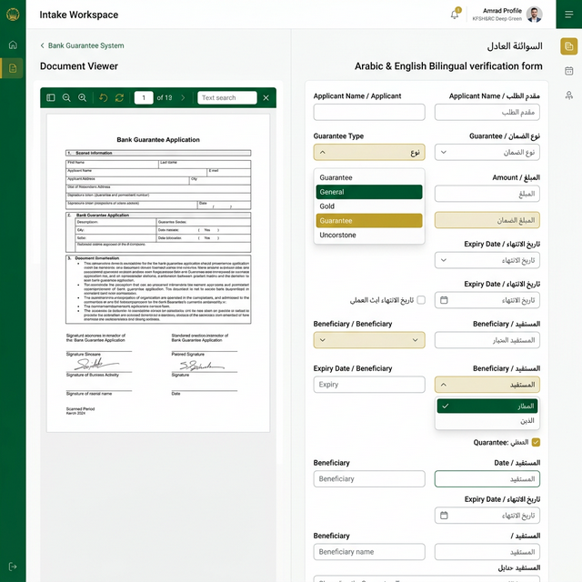
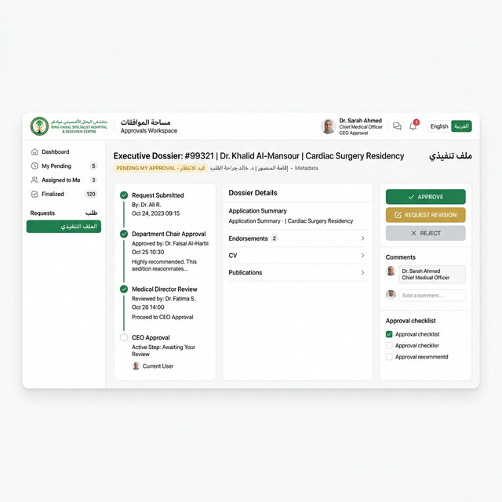
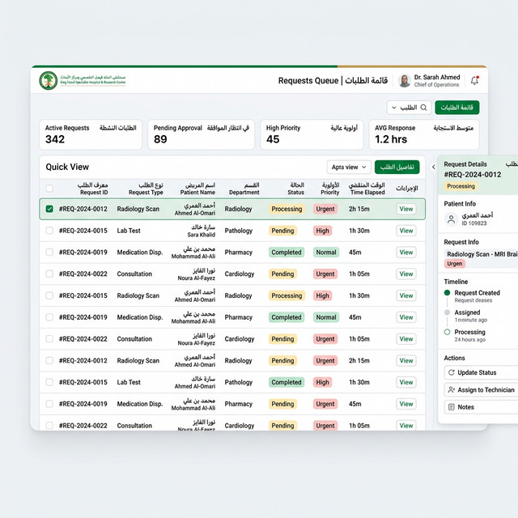
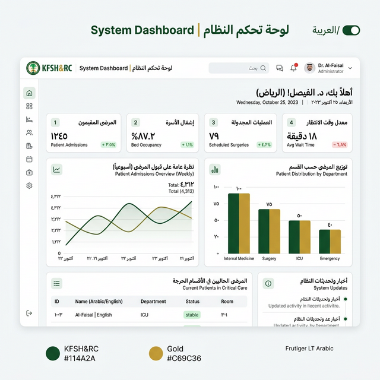
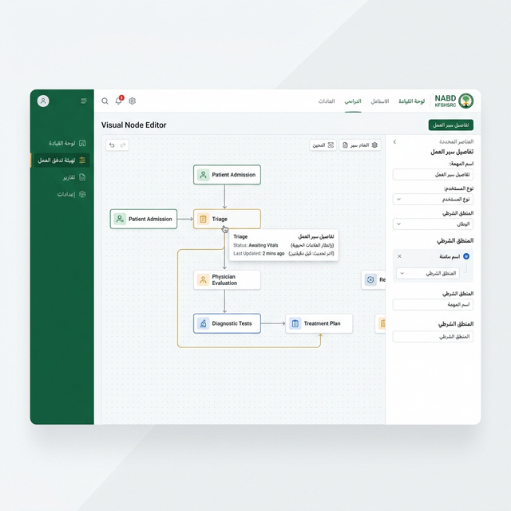

# مقترحات واجهات المستخدم (UI Proposals)

## حالة المستند

- التصنيف: `reference`
- هذا المجلد مرجع بصري معتمد، لكنه ليس المصدر التنفيذي الأعلى وحده
- الخارطة العامة للوثائق: [../README.md](../README.md)
- المصدر التنفيذي الحي للواجهة: [../frontend_reconstruction_plan.md](../frontend_reconstruction_plan.md)
- المرجع المعماري الأعلى: [../../ARCHITECTURE.md](../../ARCHITECTURE.md)

هذا المجلد يحتوي جميع الصور المرجعية الخاصة بالاتجاه الجديد لواجهات BG.

## مبادئ العمل والتطوير (Professional Principles)
لحماية استقرار النظام وتجنب تضارب العمل مع الفريق:
1. **أولوية الثيم الفاتح (Light Theme First)**: الاعتماد على الواجهات الفاتحة كخيار أساسي للوضوح المؤسسي.
2. **دعم تعدد اللغات (Bilingual/RTL)**: كل واجهة مصممة لتدعم العربية (RTL) والإنجليزية بشكل متوازي.
3. **التخطيط قبل التنفيذ (Proposal First)**: لن يتم المساس بالملفات المشتركة (مثل `_Layout.cshtml`) إلا بعد مراجعة دقيقة.
4. **عدم كسر التوافق**: المكونات الجديدة تُبنى بشكل مستقل وتُدمج تدريجياً لضمان عدم تعطل عمل باقي المطورين.

## نماذج الواجهات المطورة (Light Theme & Bilingual)

توضح هذه النماذج تطبيق الهوية البصرية لـ **KFSH&RC** بالثيم الفاتح ودعم العربية:

````carousel

<!-- slide -->

<!-- slide -->

<!-- slide -->

<!-- slide -->

````

## الهدف من هذا المجلد
- تثبيت الاتجاه العام للواجهات كمساحات عمل تشغيلية فعلية وليست صفحات سردية.
- توضيح أنماط `split-view`, `queue + detail drawer`, و`dossier` المستقلة.

## فهرس الصور المرجعية (Patterns & Legacy)

### 1. نماذج بيئة العمل المنقسمة (Workspace Split View)
- `workspace_split_view.png`: مرجع أساسي لواجهة عمل منقسمة.
- `workspace_split_view2.png`: نسخة بديلة للتحكم في التباين.

### 2. نماذج قوائم الانتظار ومساحات القرار (Queues and Decision Surfaces)
- `operations_queue.png`: مرجع أساسي لقائمة عمليات عالية الكثافة.
- `operations_queue2.png`: نسخة بديلة أكثر كثافة.

### 3. نماذج الملف التنفيذي وملفات القرار (Executive Dossier)
- `executive_dossier.png`: مرجع أساسي لواجهة dossier تنفيذية.
- `executive_dossier2.png`: نسخة بديلة تركز على الـ timeline.

---
*تم تحضير هذا المجلد ليكون مرجعاً بصرياً معتمداً للرؤية الجديدة قبل البدء في التنفيذ التقني الشامل.*
